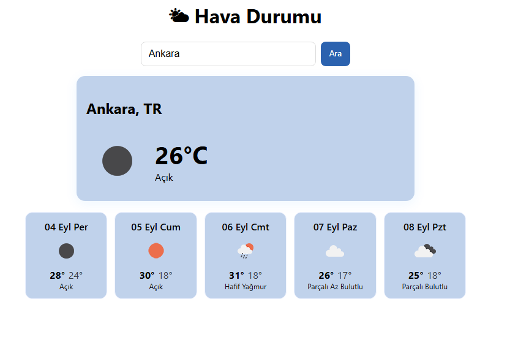
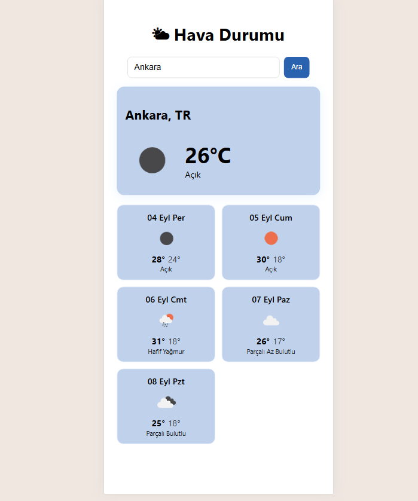

# 🌤 React Weather App

A simple weather application built with **React** that shows the current weather and a 5-day forecast for any city using the [OpenWeatherMap API](https://openweathermap.org/).

## ✨ Features
- 🔍 Search by city name  
- 🌡 Current temperature, feels like, humidity, wind speed  
- 📅 5-day forecast (daily highs & lows)  
- 📍 Option to get weather by your current location (geolocation)  
- 🌐 Multi-language support via API (currently set to Turkish `lang=tr`)  

## 🛠 Tech Stack
- React (Create React App)  
- OpenWeatherMap API  
- CSS (basic responsive styling)

## 🚀 Getting Started

## 📸 Screenshots

### Desktop View

### Mobile View

